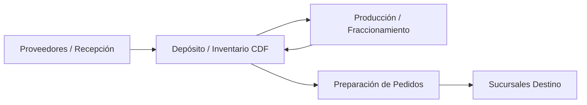
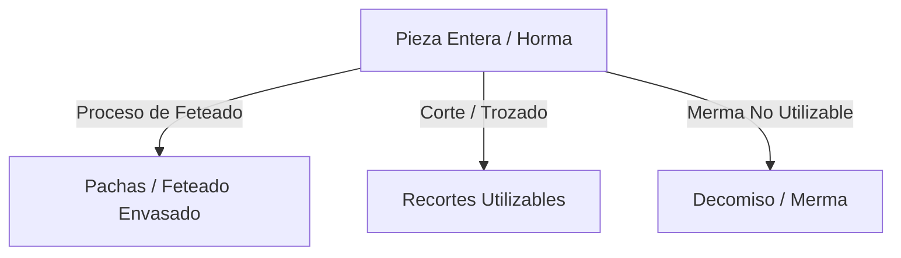
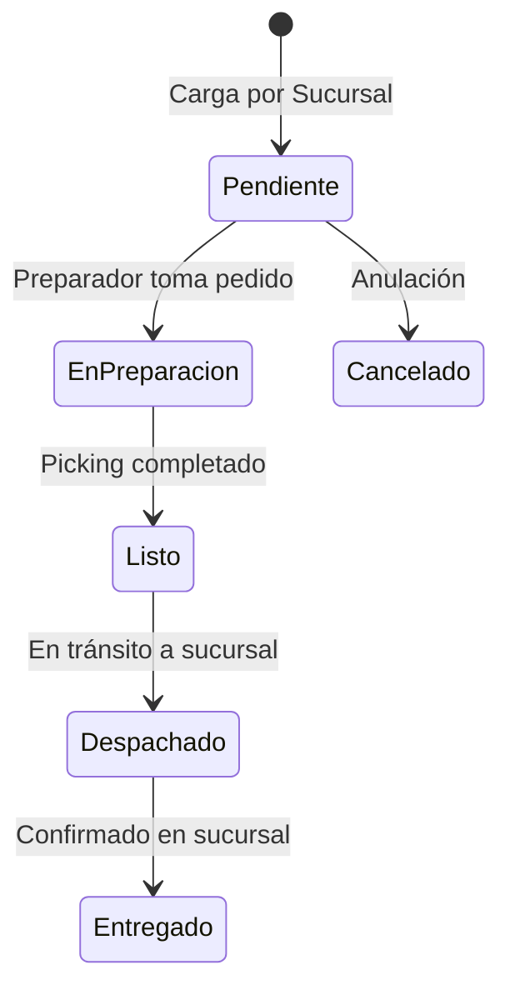

# Manual de Usuario Final — CDF Gestión
**Centro de Distribución y Fraccionamiento**

---

## 📖 Tabla de Contenidos
1. [Introducción y Conceptos Generales](#1-introducción-y-conceptos-generales)
   - [¿Qué es CDF Gestión?](#qué-es-cdf-gestión)
   - [Roles y Permisos de Acceso](#roles-y-permisos-de-acceso)
   - [Navegación e Interfaz del Sistema](#navegación-e-interfaz-del-sistema)
2. [Módulo 1: Gestión de Inventario y Stock](#módulo-1-gestión-de-inventario-y-stock)
   - [Catálogo de Productos](#catálogo-de-productos)
   - [Órdenes de Compra](#órdenes-de-compra)
   - [Ingreso de Mercadería (Recepciones)](#ingreso-de-mercadería-recepciones)
   - [Historial de Ingresos y Movimientos de Stock](#historial-de-ingresos-y-movimientos-de-stock)
   - [Control de Vencimientos](#control-de-vencimientos)
   - [Control de Piezas](#control-de-piezas)
3. [Módulo 2: Producción y Fraccionamiento](#módulo-2-producción-y-fraccionamiento)
   - [Registro de Procesos (Feteado, Envasado, Picada)](#registro-de-procesos-feteado-envasado-picada)
   - [Conversiones de Productos](#conversiones-de-productos)
   - [Gestión de Recortes](#gestión-de-recortes)
   - [Gestión de Decomisos (Bajas y Mermas)](#gestión-de-decomisos-bajas-y-mermas)
4. [Módulo 3: Pedidos y Distribución a Sucursales](#módulo-3-pedidos-y-distribución-a-sucursales)
   - [Carga de Pedido de Sucursal](#carga-de-pedido-de-sucursal)
   - [Demanda Pendiente Consolidada](#demanda-pendiente-consolidada)
   - [Preparación de Pedidos (Picking y Despacho)](#preparación-de-pedidos-picking-y-despacho)
   - [Seguimiento y Estados de Pedidos](#seguimiento-y-estados-de-pedidos)
5. [Módulo 4: Configuración y Administración del Sistema](#módulo-4-configuración-y-administración-del-sistema)
   - [Gestión de Colaboradores, Usuarios y Roles](#gestión-de-colaboradores-usuarios-y-roles)
   - [Gestión de Sucursales y Ubicaciones](#gestión-de-sucursales-y-ubicaciones)
   - [Gestión de Proveedores y Bultos](#gestión-de-proveedores-y-bultos)
6. [Preguntas Frecuentes (FAQ) y Glosario](#preguntas-frecuentes-faq-y-glosario)

---

## 1. Introducción y Conceptos Generales

### ¿Qué es CDF Gestión?
**CDF Gestión** es la plataforma informática centralizada diseñada para el **Centro de Distribución y Fraccionamiento**. Permite controlar integralmente el ciclo de vida de los productos comestibles y perecederos: desde la recepción de mercadería enviada por proveedores o transferida entre sucursales, el fraccionamiento o feteado (producción interna), la trazabilidad de lotes y vencimientos, hasta la preparación y despacho de pedidos solicitados por las sucursales comercializadoras.

---

### Roles y Permisos de Acceso

El acceso a las pantallas y operaciones está resguardado mediante un esquema de perfiles. A continuación se resumen los niveles de responsabilidad:

| Rol | Descripción y Alcance |
| :--- | :--- |
| **Administrador (Admin)** | Acceso total a todos los módulos, auditoría, parámetros del sistema, gestión de usuarios, roles, sucursales, proveedores y configuraciones. |
| **Referente** | Supervisión técnica y operativa en planta. Acceso a Inventario, Control de Piezas, Conversiones, Recortes, Decomisos y Movimientos de Stock. |
| **Preparador** | Encargado del armado de pedidos para sucursales (*picking*), conteo de bultos, carga de recepción y demanda pendiente. |
| **Feteador / Envasador** | Personal operativo del área de producción. Registra fraccionamientos, procesos de feteado, picada, envasado y conversiones. |
| **Colaborador** | Operario habilitado para registrar procesos de producción específicos a su nombre y armar pedidos asignados. |
| **Usuario / Sucursal** | Perfil de consulta y carga de requerimientos de stock / órdenes de compra. |

---

### Navegación e Interfaz del Sistema

La interfaz del sistema utiliza un diseño intuitivo con barra lateral (*sidebar*) desplegable y colapsable organizada en 4 grupos temáticos:

1. **Inventario**: Productos, Órdenes de Compra, Ingreso Mercadería (Nuevo e Historial), Historial de Stock, Vencimientos, Control de Piezas.
2. **Producción**: Procesos, Conversiones, Recortes, Decomisos.
3. **Pedidos**: Preparar, Ver Todos, Cargar Pedido, Demanda Pendiente.
4. **Configuración**: Colaboradores, Sucursales, Proveedores, Bultos, Ubicaciones, Usuarios, Permisos de Roles.

En la barra superior siempre podrá visualizar su **Usuario activo**, el **Rol asignado** y el botón para **Cerrar Sesión**.

---

## 2. Módulo 1: Gestión de Inventario y Stock

### Catálogo de Productos
* **Ruta de Menú**: `Inventario -> Productos`
* **Acceso**: Admin, Referente, Preparador, Feteador, Envasador.

Permite consultar la totalidad de los artículos gestionados en la planta.
* **Buscar y Filtrar**: Puede filtrar por nombre, código interno, categoría o estado (Entero / Fraccionado).
* **Alta / Edición de Producto (Solo Admin)**:
  1. Presione el botón `Nuevo Producto`.
  2. Complete la descripción, código de barras/código interno, unidad de medida (`kg`, `unidades`, `bultos`), pesable/no pesable.
  3. Marque si requiere control de lotes/vencimiento obligatorio.

---

### Órdenes de Compra
* **Ruta de Menú**: `Inventario -> Órdenes de Compra`
* **Acceso**: Admin, Referente, Preparador, Feteador, Envasador, Usuario.

Gestiona las intenciones de compra acordadas con los proveedores.
1. Presione `Nueva Orden de Compra`.
2. Seleccione el **Proveedor**, fecha estimada de entrega y las líneas de producto solicitadas con sus respectivas cantidades.
3. Al recibir la mercadería en planta, la Orden de Compra podrá vincularse directamente desde la pantalla de **Ingreso de Mercadería** para validar lo recibido contra lo solicitado.

---

### Ingreso de Mercadería (Recepciones)
* **Ruta de Menú**: `Inventario -> Ingreso Mercadería -> Nuevo ingreso`
* **Acceso**: Admin, Referente, Preparador, Feteador, Envasador, Usuario.

> [!NOTE]
> Esta pantalla descuenta automáticamente la **tara** (peso de la caja vacía o contenedor) según el tipo de bulto seleccionado.

#### Pasos para registrar un Ingreso:
1. **Seleccionar Origen**:
   - **Proveedor (Por Lote)**: Para recepciones directas de compras.
   - **Sucursal (Manual)**: Para devoluciones o transferencias inter-sucursales.
2. **Cargar la Grilla de Ingreso**:
   - Seleccione el **Producto**.
   - Indique el **Número de Lote** y la **Fecha de Vencimiento** impresa en el empaque.
   - Ingrese la cantidad de **Piezas** y el **Peso Bruto (kg)**.
   - Seleccione el **Tipo de Bulto** (ej. *Caja Cartón*, *Jaula Plástica*). El sistema restará el peso de tara automáticamente obteniendo el **Peso Neto (kg)**.
   - Asigne la **Ubicación en Depósito** (ej. *Cámara 1 - Estante A*).
3. **Confirmación**: Presione `Confirmar e Ingresar al Stock`. La mercadería se acreditará inmediatamente al inventario.

---

### Historial de Ingresos y Movimientos de Stock
* **Rutas de Menú**: 
  - `Inventario -> Ingreso Mercadería -> Historial`
  - `Inventario -> Historial de Stock`

Permite auditar el histórico de recepciones y las variaciones del inventario (entradas por recepción, salidas por ventas/despacho, bajas por decomiso o transformaciones por fraccionamiento).
- Puede filtrar por **Rango de Fechas**, **Producto** o **Lote**.
- Permite exportar o imprimir los comprobantes de recepción.

---

### Control de Vencimientos
* **Ruta de Menú**: `Inventario -> Vencimientos`
* **Acceso**: Todos los roles.

Muestra un semáforo de alerta con los lotes almacenados en la planta:
- 🔴 **Vencido**: Producto cuya fecha de vencimiento ya expiró. Debe evaluarse para decomiso.
- 🟡 **Próximo a Vencer (0 a 15 días)**: Prioritario para despacho o procesamiento inmediato (regla FEFO: *First Expired, First Out*).
- 🟢 **En Regla**: Producto con margen amplio de vigencia.

---

### Control de Piezas
* **Ruta de Menú**: `Inventario -> Control de Piezas`
* **Acceso**: Admin, Referente.

Permite auditar el conteo individual de hormas, piezas de fiambre o trozos cárnicos de alto valor en inventario.
- Permite auditar si el peso promedio de la pieza coincide con las tolerancias esperadas.
- Facilita el pesaje individual antes de enviar las piezas a la sala de feteado o fraccionamiento.

---

## 3. Módulo 2: Producción y Fraccionamiento

### Registro de Procesos (Feteado, Envasado, Picada)
* **Ruta de Menú**: `Producción -> Procesos`
* **Acceso**: Admin, Referente, Feteador, Envasador, Colaborador.

Esta interfaz registra la actividad diaria de la sala de fraccionamiento:
1. Presione `Nuevo Proceso`.
2. Seleccione el **Colaborador / Operario** a cargo (ej. *Feteador 1*).
3. Elija el tipo de proceso: `Feteado`, `Envasado al Vacío`, `Picada`, `Trozado`.
4. Seleccione la **Materia Prima** consumida (ej. *Horma de Jamón Cocido Entero*, Lote #X).
5. Ingrese la cantidad de piezas procesadas, peso bruto consumido y el **Producto Terminado** resultante (ej. *Sobres de Jamón Feteado 200g*).
6. Registre si se generó **Recorte** o **Merma**.
7. Guarde el proceso para descontar la materia prima del stock y dar de alta los paquetes terminados.

---

### Conversiones de Productos
* **Ruta de Menú**: `Producción -> Conversiones`
* **Acceso**: Admin, Referente, Feteador, Envasador.

Permite realizar transformaciones directas o equivalencias entre un producto padre (entero) y productos hijos (fraccionados).
- Calcula automáticamente la **Rendibilidad %** y el **Porcentaje de Merma**.
- Mantiene el historial de conversión para auditorías de eficiencia de fraccionamiento por operario.

---

### Gestión de Recortes
* **Ruta de Menú**: `Producción -> Recortes`
* **Acceso**: Admin, Referente.

Administra el sobrante de piezas utilizables generado en los procesos de corte o feteado (puntas de fiambre, recortes limpios de queso).
- Los recortes pueden ser reincorporados como materia prima para procesos de `Picada` o embutidos secundarios.
- Permite consultar el stock acumulado de recortes por categoría.

---

### Gestión de Decomisos (Bajas y Mermas)
* **Ruta de Menú**: `Producción -> Decomisos`
* **Acceso**: Admin, Referente.

> [!CAUTION]
> El decomiso da de baja de forma definitiva e irreversible el stock seleccionado.

Pasos para registrar un Decomiso:
1. Presione `Nuevo Decomiso`.
2. Seleccione el **Producto** y el **Lote** específico.
3. Ingrese los **Kg / Unidades** a desechar.
4. Indique el **Motivo**: `Vencimiento`, `Rotura de Cadena de Frío`, `Envasado Defectuoso`, `Deterioro / Contaminación`.
5. Guarde la operación. El movimiento quedará asentado en la auditoría con el usuario responsable.

---

## 4. Módulo 3: Pedidos y Distribución a Sucursales

### Carga de Pedido de Sucursal
* **Ruta de Menú**: `Pedidos -> Cargar Pedido`
* **Acceso**: Admin, Referente, Preparador, Feteador, Envasador.

Permite crear una solicitud formal de mercadería para una sucursal destino:
1. Seleccione la **Sucursal Solicitante** y la **Fecha Deseada de Entrega**.
2. Agregue los productos deseados indicando la cantidad solicitada.
3. Presione `Guardar Pedido`. El pedido ingresará en estado **PENDIENTE**.

---

### Demanda Pendiente Consolidada
* **Ruta de Menú**: `Pedidos -> Demanda Pendiente`
* **Acceso**: Admin, Referente, Preparador, Colaborador, Usuario.

Muestra la suma total de las cantidades solicitadas por **todas** las sucursales para un determinado producto.
- Permite a la sala de producción saber cuántas unidades/kg de producto feteado o preparado deben elaborar durante el día.

---

### Preparación de Pedidos (Picking y Despacho)
* **Ruta de Menú**: `Pedidos -> Preparar`
* **Acceso**: Admin, Referente, Preparador, Colaborador.

Es la herramienta de trabajo en depósito para el armado de los pedidos (*picking*):
1. Seleccione un pedido en estado **PENDIENTE**.
2. El sistema mostrará la lista de productos requeridos y la ubicación en estantería/cámara.
3. Al escanear o seleccionar el lote a despachar, el preparador confirma las cantidades reales embaladas.
4. Indique los **Bultos / Cajas** en los que se empaquetó el pedido.
5. Al finalizar, presione `Finalizar Preparación`. El pedido cambiará a estado **LISTO / DESPACHADO**, descontando el stock correspondiente del depósito CDF.

---

### Seguimiento y Estados de Pedidos
* **Ruta de Menú**: `Pedidos -> Ver Todos`
* **Acceso**: Admin, Referente, Preparador, Colaborador.

Permite consultar el listado completo de pedidos y su estado en el flujo de trabajo:

---

## 5. Módulo 4: Configuración y Administración del Sistema

> [!IMPORTANT]
> Los ítems de este módulo son exclusivos del rol **Administrador (Admin)**.

### Gestión de Colaboradores, Usuarios y Roles
* **Colaboradores** (`Configuración -> Colaboradores`): Registro del personal operario de planta (nombre, legajo, área asignada).
* **Usuarios** (`Configuración -> Usuarios`): Creación de cuentas de acceso al sistema, asignación de contraseña y vinculación a un Colaborador y Rol.
* **Permisos de Roles** (`Configuración -> Permisos de Roles`): Matriz dinámica para habilitar o restringir vistas del menú según la función de la persona.

---

### Gestión de Sucursales y Ubicaciones
* **Sucursales** (`Configuración -> Sucursales`): Registro de los locales de venta y puntos de entrega (código, dirección, teléfono, responsable).
* **Ubicaciones** (`Configuración -> Ubicaciones`): Mapeo del depósito central CDF (Cámaras de frío, pasillos, estantes y posiciones).

---

### Gestión de Proveedores y Bultos
* **Proveedores** (`Configuración -> Proveedores`): Padrón de empresas suministradoras de insumos y materia prima.
* **Bultos** (`Configuración -> Bultos`): Definición de tipos de empaque y sus respectivas **taras en kilogramos** (ej. *Caja de cartón 0.5 kg*, *Bin plástico 4.2 kg*).

---

## 6. Preguntas Frecuentes (FAQ) y Glosario

### Preguntas Frecuentes (FAQ)

**1. ¿Qué hago si el peso neto al ingresar mercadería da negativo o incorrecto?**
> Verifique haber seleccionado el tipo de bulto adecuado. Recuerde que el sistema resta automáticamente la tara de la caja o jaula del peso bruto ingresado.

**2. ¿Cómo priorizo los productos a despachar para evitar que se venzan en depósito?**
> Utilice la regla **FEFO** consultando la pantalla de `Inventario -> Vencimientos`. Despache primero los lotes resaltados en amarillo o con fecha de caducidad más cercana.

**3. ¿Se puede modificar un pedido que ya está en estado "LISTO" o "DESPACHADO"?**
> No. Una vez finalizada la preparación, el stock ya fue descontado. En caso de requerir corregir un despacho, un usuario con perfil **Admin** o **Referente** deberá cancelar o ajustar la orden y rearmarla.

**4. ¿Dónde registro la merma de grasa o cuero en el proceso de feteado?**
> En la pantalla de `Producción -> Procesos`, complete el campo **Merma (kg)** al cerrar la orden de trabajo. De esta forma, el balance de masa quedará cerrado correctamente.

---

### Glosario de Términos

* **Bulto**: Contenedor físico (caja, jaula, bin, pallet) utilizado para transportar o almacenar productos.
* **Tara**: Peso del empaque o contenedor vacío que debe descontarse del peso total para obtener el peso neto de la mercadería.
* **FEFO (*First Expired, First Out*)**: Criterio de gestión logística donde el lote que vence primero es el primero en ser despachado o procesado.
* **Picking**: Proceso de selección y recolección de productos desde las ubicaciones de almacenamiento para armar un pedido.
* **Decomiso**: Retiro definitivo y baja del inventario de productos no aptos para consumo.
* **Recorte**: Sobrante de materia prima limpia y apta generado durante el trozado o fraccionamiento, reincorporable al proceso productivo.
* **Rendimiento / Rendibilidad**: Porcentaje de aprovechamiento de un producto entero convertido en producto fraccionado final.
